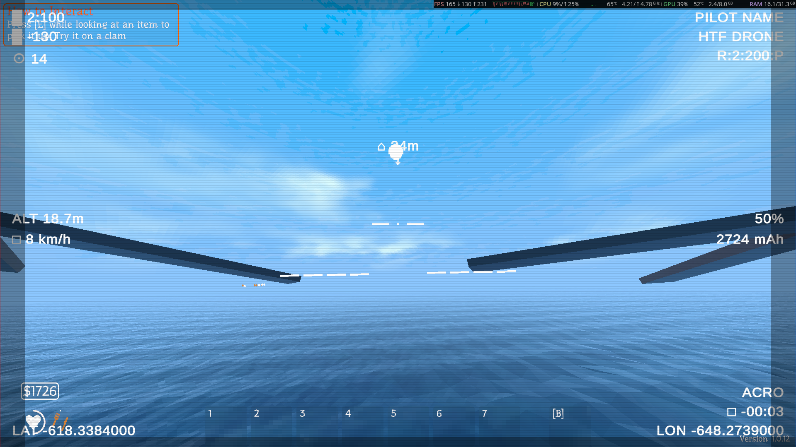
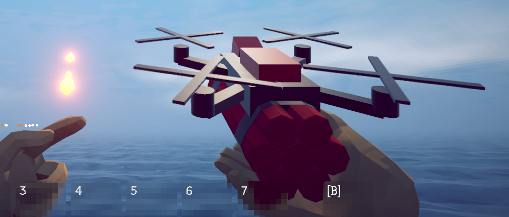
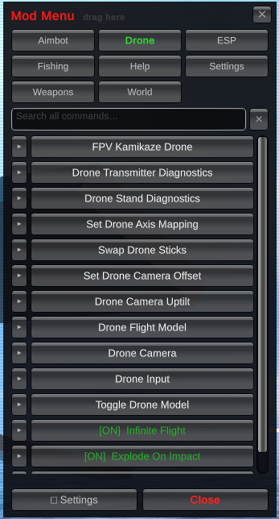

# HTFDrone

An FPV kamikaze drone mod for *How to Fish*. Turn a stick of dynamite into a hand-flown,
acro-mode quadcopter with a real Betaflight-style OSD, then fly it into something and watch it go
off. Buy one from a stand on every island, or convert a TNT you're already holding on the spot.

No custom drone asset is used — the "drone" *is* the game's own explosive item, wearing a
quadcopter frame built at runtime out of primitives and flown with real rigidbody physics. That's
what makes it work in multiplayer with no custom networking: the game's existing item-sync
already replicates a thrown TNT to everyone else, modded or not.



## Requirements

- [BepInEx](https://github.com/BepInEx/BepInEx) (Mono, x64) installed for *How to Fish*
- **CTDynamicModMenu** — this mod's commands and toggles are registered into it; build it
  alongside this project (see `../CTDynamicModMenu`)
- A joystick, gamepad, or RC transmitter in USB/HID mode to actually fly the thing (see
  [Flying it](#flying-it) below — there is no keyboard flight mode)

## Installing

Drop the built `HTFDrone.dll` into `BepInEx/plugins/` alongside CTDynamicModMenu. Building the
project (`dotnet build`) copies it there automatically if the game is installed at the path
recorded in `path.txt` — see [Building](#building) below.

## Getting a drone

- **Buy one.** Every island gets a drone stand next to its existing shop, priced the same as
  whatever explosive it's built from (dynamite, by default). Interact with it like any other
  purchase.
- **Convert one you're holding.** Pick up an explosive and press the game's skin-swap key (**Y**/
  **C** by default) to assemble it into a drone in your hands, or back into plain TNT. This
  repurposes the existing skin-cycle binding rather than adding a new key — explosives have no
  skins to cycle anyway, so nothing is lost.
- **Launch it straight away** with `/fpvdrone` (optionally `/fpvdrone <item name>` for a payload
  other than dynamite) — spawns one where you're looking and hands off to the FPV camera
  immediately.

Throwing (or dropping) a drone you're holding launches it. Only one drone can be in flight at a
time.



## Flying it

Flight is real acro/rate-mode physics, not scripted movement — the drone has actual mass, gravity,
and drag, and pitch/roll/yaw are pure angular rates with no auto-leveling and no tilt limit. It
can flip, loop, and fly inverted exactly like a real acro quad.

Flying needs a transmitter, gamepad, or joystick — there's no keyboard stick input. The mod reads
through Unity's Input System (the game's shipped Input Manager has no joystick axes registered),
trying standard Gamepad mode first and falling back to raw HID Joystick axes. It's built around a
FrSky Taranis QX7 in Mode 2 over USB, but anything that shows up as a gamepad or joystick should
work.

| Control | Default mapping |
|---|---|
| Throttle / Yaw | Left stick (vertical / horizontal) |
| Pitch / Roll | Right stick (vertical / horizontal) |
| Detonate in flight | Right or left trigger, south button, start button, transmitter trigger, or **Enter** on keyboard |

Run `/dronediag` to list every detected axis with its live value — move one stick at a time to
see which index responds, then use `/droneaxis <roll\|pitch\|throttle\|yaw> <index>` to remap a
HID joystick's raw axes, or `/dronestick` to swap which stick is throttle/yaw vs. pitch/roll for
gamepad-mode transmitters.

Rates, expo-style sensitivity and channel reversal are set in the mod menu rather than on the
radio, so one transmitter setup flies every way you want it to — see [Tuning](#tuning) below.

While piloting, your view switches to a nose-mounted FPV camera and your own inputs are frozen
(same mechanism the game uses for pausing or dying) until the drone is destroyed or the flight
timer runs out, at which point control returns to your own body.

## The OSD

The FPV feed carries a Betaflight/INAV-style on-screen display: an artificial horizon derived
from the camera's actual view direction (not Euler angles, so it stays correct through flips and
inverted flight), a fixed centre crosshair, altitude, speed, a battery/mAh readout, link stats,
and a home arrow pointing back at the launch point.

## Tuning

Everything worth adjusting is a slider in the mod menu's "Drone" category — no config-file
editing, and no relaunch. Every value below is read live, so dragging a slider retunes a drone
that is already in the air.

**Drone Flight Model** (`/droneflight`)

| Slider | Range | Default | What it does |
|---|---|---|---|
| Max Thrust | 5–80 | 28 | Full-throttle thrust, in units of gravity |
| Hover Throttle | 0.1–0.9 | 0.55 | Stick position that exactly cancels gravity |
| Max Rate | 60–1200 | 360 | Degrees/sec at full stick deflection |
| Linear Drag | 0–3 | 0.6 | Air resistance — 0 coasts forever |
| Flight Time | 5–300 | 20 | Seconds before self-destruct (ignored with `/droneinfinite`) |

**Drone Camera** (`/dronecamsettings`)

| Slider | Range | Default | What it does |
|---|---|---|---|
| Forward Offset | −0.5–0.5 m | 0.14 | How far forward of frame centre the lens sits |
| Height Offset | −0.2–0.4 m | 0.035 | How far above frame centre the lens sits |
| Field of View | 50–150° | 105 | Lens FOV — wider is more fisheye |

Uptilt has its own entry ("Drone Camera Uptilt", `/dronetilt`) with a 0–90° slider, kept separate
so exactly one place owns that value.

**Drone Input** (`/droneinput`)

| Slider | Range | Default | What it does |
|---|---|---|---|
| Stick Deadzone | 0–0.5 | 0.08 | Stick travel ignored around centre |
| Pitch/Roll/Yaw/Throttle Sensitivity | 0–3 | 1 | Per-axis multiplier on stick travel (1 = stock) |
| Invert Pitch/Roll/Yaw/Throttle | 0 or 1 | 0 | Reverses that channel |
| Roll/Pitch/Throttle/Yaw Axis | 0–15 | 3/2/1/0 | HID axis index (raw joystick mode only) |

Sensitivity is applied in one place for both input paths, so a gamepad-mode and a raw-HID
transmitter fly identically. It is applied *after* the deadzone — scaling first would let a low
sensitivity pull a genuine stick movement below the deadzone and swallow it entirely.

## Commands

All commands also appear in the CTDynamicModMenu UI (default key **F4**) under its own "Drone"
category, as buttons, toggles, or — for the tuning commands — an arrow that expands into the
sliders described above:



| Command | Description |
|---|---|
| `/fpvdrone [item]` | Launch a drone immediately, optionally with a payload other than dynamite |
| `/dronediag` | List detected transmitter/joystick axes and their live values |
| `/droneaxis <stick> <index>` | Map a raw HID joystick axis index to roll/pitch/throttle/yaw |
| `/dronestick` | Swap which physical stick is throttle+yaw vs. pitch+roll |
| `/dronecam <forward> [height]` | Set the FPV camera's mount position on the frame |
| `/dronetilt <degrees>` | Set the FPV camera's uptilt (0–90°, default 30°) |
| `/droneflight` | Report the flight model values; carries the thrust/rate/drag/flight-time sliders |
| `/dronecamsettings` | Report the camera mount and FOV; carries their sliders |
| `/droneinput` | Report deadzone, sensitivity and axis mapping; carries their sliders |
| `/dronemodel` | Toggle whether you see your own drone's airframe in FPV |
| `/droneinfinite` | Toggle infinite flight time (ignores the flight timer) |
| `/droneimpact` | Toggle whether hitting something detonates the drone |
| `/droneothers` | Toggle whether other modded players' drones render as drones for you |
| `/dronestanddiag` | Dump a drone stand's object hierarchy and live scales (debugging) |

## How it looks to other players

A flying drone is still, under the hood, the game's stock explosive item — so a player without
the mod sees ordinary flying TNT and takes normal explosion damage. Nothing about shared game
state depends on who has the mod installed.

A player *with* the mod sees an actual quadcopter: a frame with spinning props, built the moment
another client is detected simulating the item's physics and flying it (as opposed to just having
thrown it). This is purely cosmetic and entirely local — turn it off with `/droneothers` if you'd
rather see plain TNT.

## Building

```sh
dotnet build
```

Expects the game's managed assemblies and CTDynamicModMenu.dll under `Dependencies/` — see
`deps.txt` for the full manifest and where each file comes from. The build copies the finished
DLL into the game's `BepInEx/plugins/` folder automatically; override the target with
`-p:PluginDir=...` or by editing `path.txt`.
